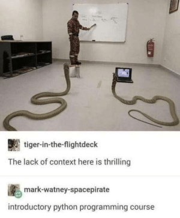

# Python
This lesson is all about [Python](https://en.wikipedia.org/wiki/Python_language), a high-level, general-purpose programming language.

## Warm-Up
[Click here to draw something within a Python program.](https://trinket.io/embed/python/813d7e3f14f0?outputOnly=true&runOption=run&start=result)

## PowerPoint Presentation
<iframe src='https://view.officeapps.live.com/op/embed.aspx?src=https://hylandtechoutreach.github.io/mcccc/Python/Python.pptx' width='100%' height='450px' frameborder='0'></iframe>

## Code-Along
[Click here to go to Trinket and start coding!](https://trinket.io/embed/python/b3a93390450d)

[Click here for the code-along instructions.](PythonCodeAlong.md)

## More Python
[Click here to explore Python possibilities!](PythonSelfPacedExploration.md)
