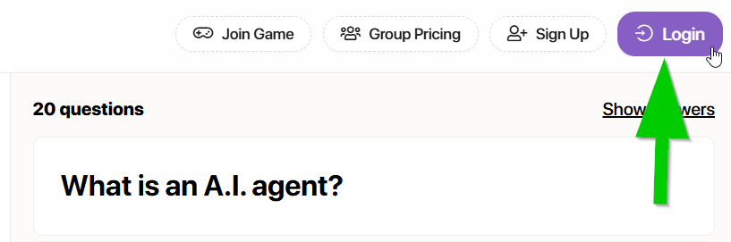
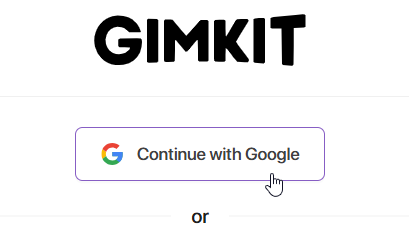
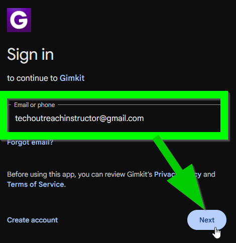
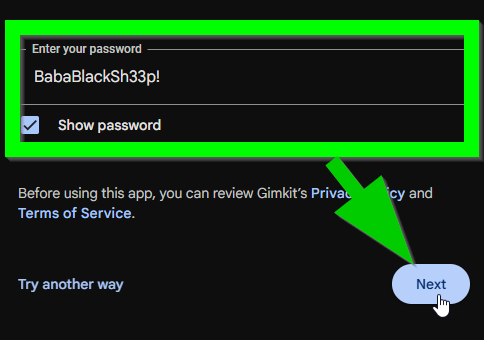
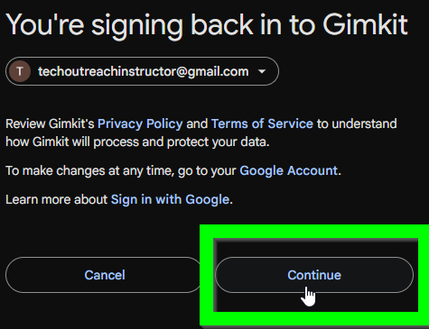
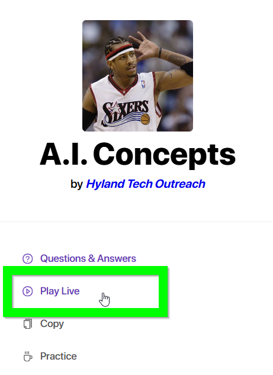
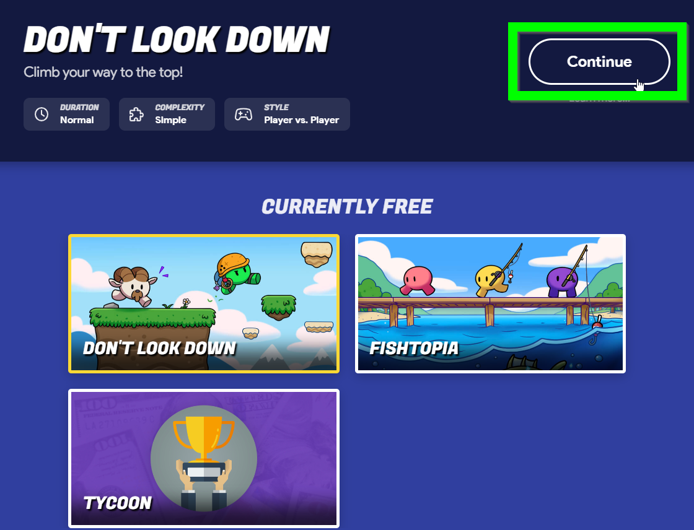
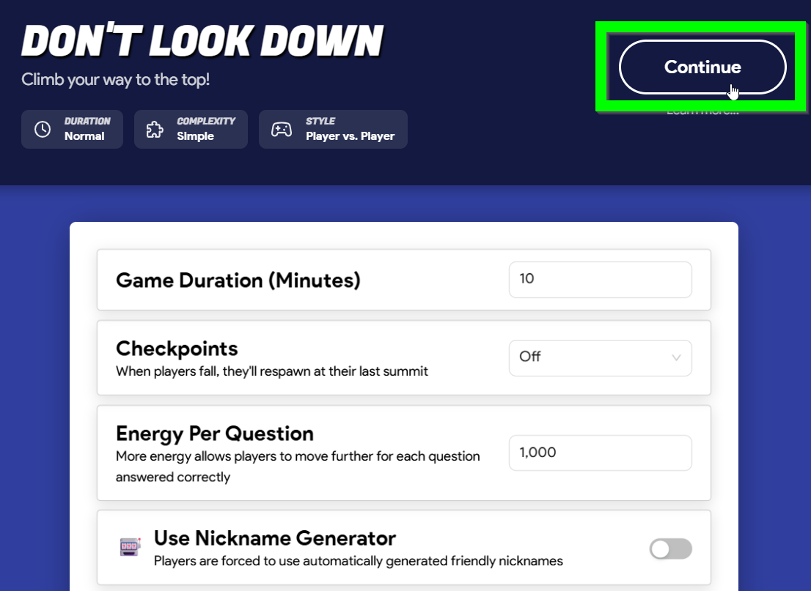
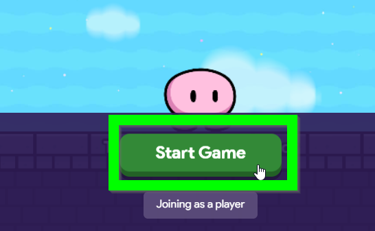

# Gimkit Instructions
Follow these instructions to log into Gimkit and start a game!

1. Go to the [Gimkit Question Set](http://gimkit.com/view/68f651aec328f4c55fcacf00)
1. Click the "Login" button in the upper right  
  
1. On the next screen, click the "Continue with Google" button  
  
1. Enter **techoutreachinstructor@gmail.com** as the email, and click the "Next" button  
  
1. Enter **BabaBlackSh33p!** as the password, and click the "Next" button  
  
1. Click the "Continue" button  
  
1. Back in the Question Set, click the "Play Live" link on the left  
  
1. Select whatever games are free, and click the "Continue" button in the upper right  
  
1. Defaults should be fine (feel free to change if desired), but click "Continue" again  
  
1.  Give students some time to join by going to **gimkit.com/join** and entering the code
1. When they have all joined, click the "Start Game" button  
  

That's it! The game is self-paced, so students play and answer questions on their own.

The winner(s) of the game can receive tickets for their efforts.
