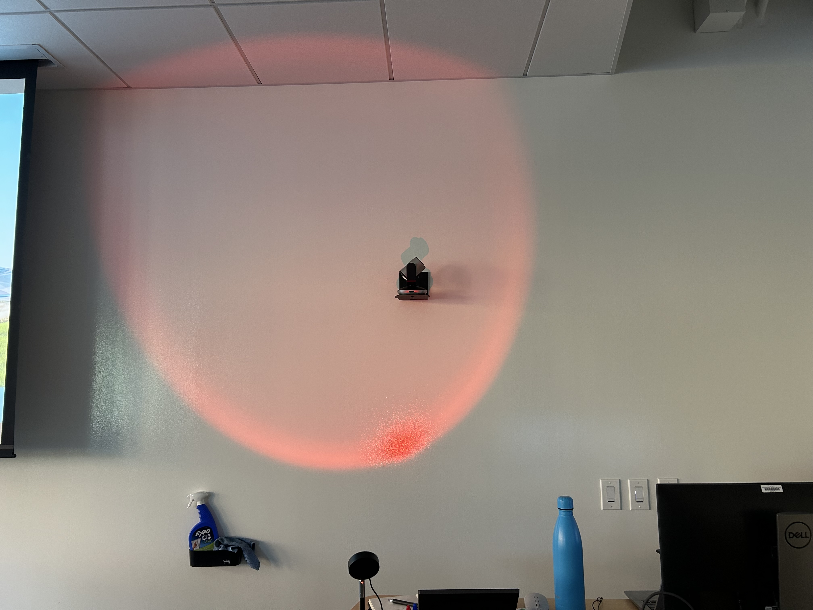

# Guidelines
Here are some basic classroom guidelines.

- 2 drinks per night
- 3 snacks per night
- Wash your hands after dinner
- Use hand sanitizer
- Throw away all your trash
- Additional options available (ramen or additional snacks)

## Focus Time
Focus during focus time when the light shining by the lectern is red!

