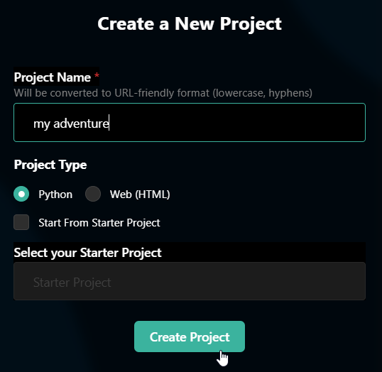

## Code-Along: CHOOSE YOUR OWN ADVENTURE
In this activity, use Python to create a text-based CYA game!

## Part Zero: Getting Started
First, create a new project in HyTOP.

1. Go to the [HyTOP Create Project Page](https://hytop.onrender.com/create-project)
1. Enter a **Project Name**, and select "Python" as the **Project Type**
1. Click the **Create Project** button



## Part One: Sleeping
First, add some code to make the program sleep (aka do nothing for a while).

1. Click into the **main.py** area to start editing
1. Type `from time import *` into the editor
1. Make two new lines, and then type `sleep(1)`
1. Save the project to see it run!

Right now, the program doesn't really do anything, just sleeps for one second - but it should be running! Code so far:

```py
from time import *

sleep(1)
```

## Part Two: Printing
Okay now it's time to do something. Let's make the program print out a few starter messages.

1. Make a couple new lines in the editor
1. Add a `print` statement that says "You find yourself alone in a classroom..."
  - Make sure everything is correct: print, parentheses, quotes!
1. Under that, add another `sleep`
1. Under the `sleep`, add another `print` that says "There are computers here..."
1. Beneath that, add one more `sleep`
1. Save the project and see it run again!

Now, the program should be printing out some messages, and pausing in between. The added code should look something like this:

```py
print("You find yourself alone in a classroom...")
sleep(1)
print("There are computers here...")
sleep(1)
```

## Part Three: Asking
So far, the program has only had static _output_ - it's just the same messages. It's time to make it interactive! We can do this by asking a question.

1. Make another couple of new lines in the editor
1. Add a `print` statement that says "What do you want to do?"
1. Under that, make a new _variable_ named `answer` with `answer = `
1. After the `=` on the same line, add an `input("> ")`
  - This will prompt for an answer
  - It will store the response in the `answer` variable
1. Under that, add another `print`
1. Make the message for the `print` say "You want to "
1. After the `"` but before `)`, add a `+`
1. After the `+`, add `answer` to print the user's answer!
1. Under that, add an empty `print` to add an extra new line
1. For good measure, add another `sleep` statement under that
1. Save the project, and run it!

Now, you should be able to enter an answer that is stored and re-displayed! The code should look something like this:

```py
print("What do you want to do?")
answer = input("> ")
print("You want to " + answer)
print()
sleep(1)
```

## Part Four: Answering
Now, the program can do something different depending on what the user says! If the say they want to leave, we can reply to that specific request.

1. On a new line, create an `if` statement
1. Check if `answer` is `==` to `"leave"`
1. Add a `:` at the end of the line, and press Enter
1. On the indented line, add a `print` statement saying "You try to leave but the door is locked..."
1. Save the project, run it, and try entering things!

You should be able to go through different paths now - one where you try to leave, and one where you try to do literally anything else. The added code should look something like this:

```py
if answer == "leave":
    print("You try to leave but the door is locked...")
```

## Part Five: Branching
Next, it's time to add some branching logic so that different things can keep happening. Add the ability to try to log into the computer.

1. Make a new line with an `elif` (this is like `if` but only if the first `if` is `False`)
1. Now, check if `answer` is `==` to `"login"`
1. Add a `:` at the end of the line, and press Enter
1. On the indented line, add a `print` statement saying "The computer glows with a message..."

### Branching the Branch
Now there are two possibilities... but this branch can continue even further!

1. Under the computer glowing `print`, still indented, make a new line
1. There, create a new variable named `pw`
1. Set it to be an `input` prompting the user with `"Please enter a password: "`
1. Check if `pw` is `==` to `"Midtown12345"`
  - If it is, `print` a message saying `"You unlocked the PC!"`
  - In the `else` case, print a message saying `"Password incorrect"`

The added code should look something like this:

```py
elif answer == "login":
    print("The computer glows with a message...")
    pw = input("Please enter a password: ")
    if pw == "Midtown12345":
        print("You unlocked the PC!")
    else:
        print("Password incorrect")
```

## Conclusion
Now the program is a full interactive story with multiple paths! There is a lot more that is possible with this, but following these same principles, the program could be extended to a full-featured narrative game.

One of the last things to do is just `print` a message saying `"The end"`! Add this code to the very bottom:

```py
print()
print("The end")
```

That's it!

### Final Code
By the end of the activity, your code might look something like this:

```py
from time import *

sleep(1)

print("You find yourself alone in a classroom...")
sleep(1)
print("There are computers here...")
sleep(1)

print("What do you want to do?")
answer = input("> ")
print("You want to " + answer)
print()

if answer == "leave":
    print("You try to leave but the door is locked...")
elif answer == "login":
    pw = input("Please enter a password: ")
    if pw == "Midtown12345":
        print("You unlocked the PC!")
    else:
        print("Password incorrect")

print()
print("The end")
```
