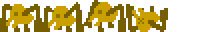

# Animation Challenges
After completing the [Follow-Along](SpriteReplacementFollowAlong.md), work on some of these challenges. There are a few different options; feel free to get creative and do whatever you want to do with Piskel and/or the platformer game!

## Option 1: A Totally New Sprite
Go to [Piskel](https://www.piskelapp.com/kids) and work on creating a new sprite of any kind. This could be a character, an enemy, a background element, or a completely abstract work of art! Try to add multiple frames to make it into an animation.

This challenge can be completed in Piskel without doing anything with the existing game.

## Option 2: Updating the Existing Game Art
Similar to how the player was replaced with a new Piskel animation, replace some of the other game assets.

#### Tips
If you are running into any issues, make sure to abide by these rules:

- Do not change the size of the canvas for one of the existing Piskel sprites
- Do not change the number of frames for an existing sprite
- Export each Piskel as a PNG
- Make sure each filename is correct in the code

### Key
Replace the key sprite in the game with a new one.

### Coin
Replace the coin sprite in the game with a new one.

### Spider
Replace the spider sprite in the game with a new one.

