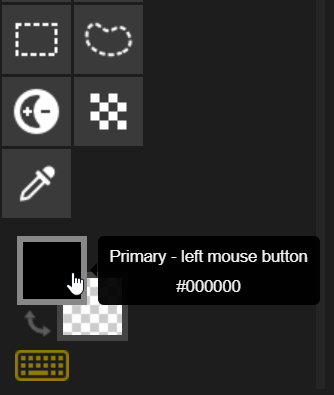
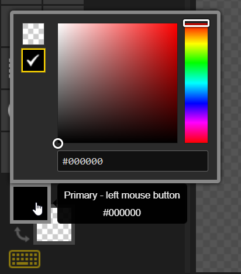
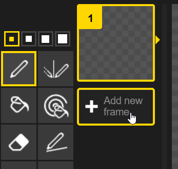
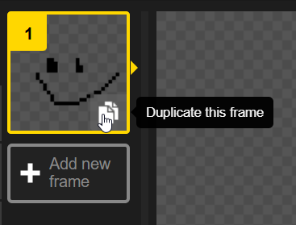
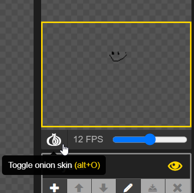
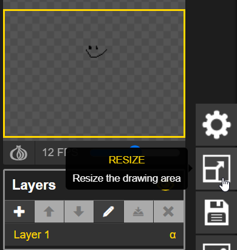
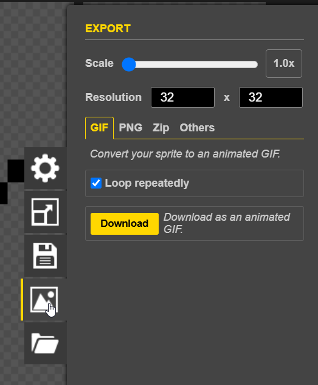

# Piskel Demo
[Piskel](https://www.piskelapp.com/kids/) is a free online tool for creating pixel art sprites/animations. There are a ton of possibilities! This guide contains a few of the basic tools and capabilities of the app.

## Drawing Tools
There are several Drawing Tools, selectable in the section on the left.

#### Pen

Draw individual pixels.

#### Vertical Mirror Pen

Draw the same on the left and right.

#### Paint bucket

Fill in a closed shape with a color.

#### Paint all pixels of the same color

Fill in every pixel of a certain color to a new color. Note that it is possible to do this across frames as well.

#### Stroke

Draw lines.

#### Rectangle

Draw rectangles.

#### Circle

Draw Circles.

#### Move

Move the whole drawing around on the canvas.

#### More

There are several additional tools as well -  feel free to play around with them to see what they do.

## Other Options
There are several other ways to create pixel art beyond using the drawing tools.

#### Color picker

To use multiple colors in the art, choose new colors:

#### Multiple Frames

Click the "+ Add new frame" button in the Frame Selector section to add a new frame. This will create an animation!

#### Duplicating a Frame

It is also possible to duplicate an existing frame. Click the "Duplicate this frame" button in the bottom right of a frame in the Frame Selector section.

#### Onion Skin

When creating animations, it can be helpful to see the previous frame when drawing the next one. This is possible by toggling the "Onion skin" under the animation preview:

#### Resizing

Click the "Resize" button from the options menu to resize the drawing area. There are several ways to resize the piece.

#### Export

Click the "Export" button from the options menu to export the piece. There are several ways to export.

## Create Something
With the tools and examples above, take some time to create an animation in Piskel!
