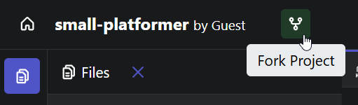
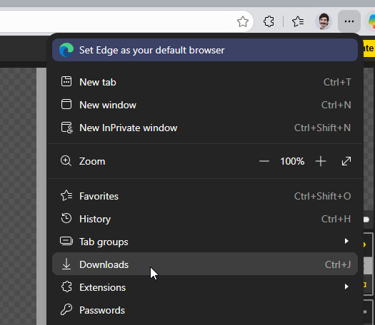
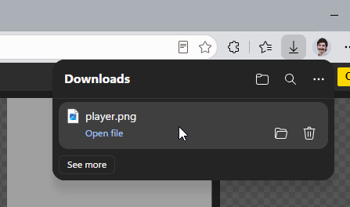
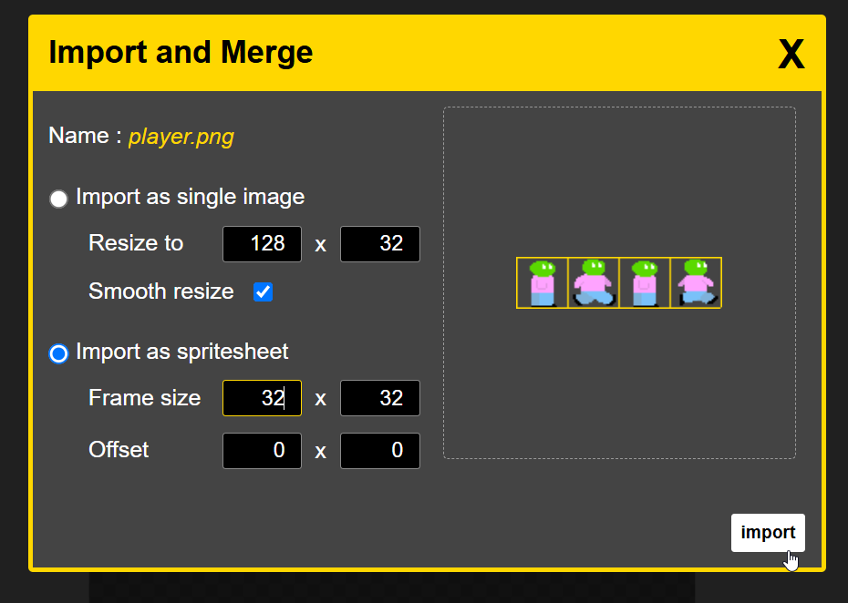
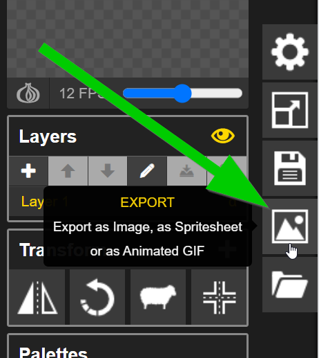
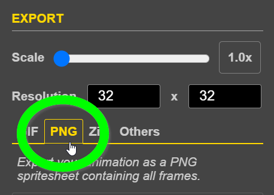
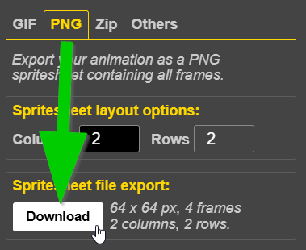
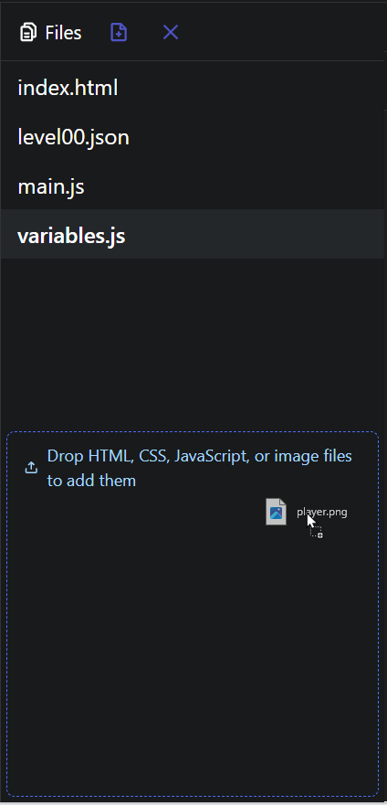
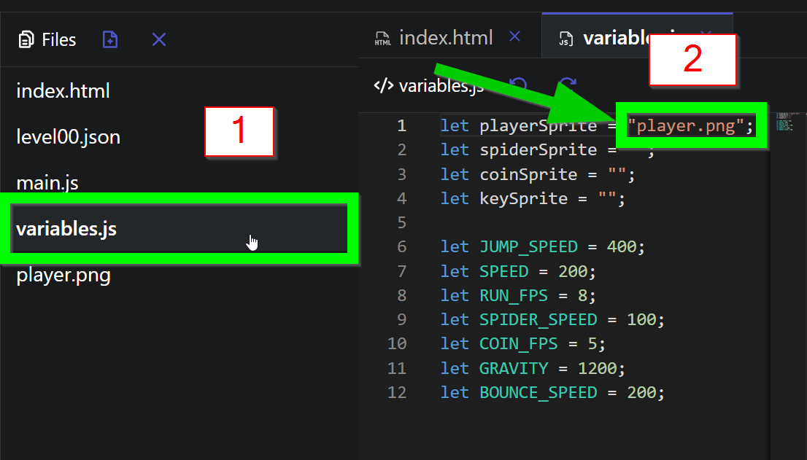

# Sprite Replacement Follow-Along
Artists often create pixel art animations to be used in retro-style games. Follow the instructions to modify an existing game with new custom art!

## The Existing Game
[Click here to go to the starter project.](https://hytop.onrender.com/e/small-platformer)

To create your own version of the project, click the "Fork" button in the upper left:



Play the game in the preview on the right using the arrow keys!

The goal of this activity will be to replace the player sprite with a new one.

## Modifying the Player Walk Cycle
Now it's time to create a new player walk cycle! At this point, try not to change too much - it will always be possible to come back and further customize the player.

### Importing the Existing Player
Follow the steps below to import the player sprite.


1. Right click the picture above and select "Save image as..."
1. Save the image on your computer with **player.png** as the name
1. Open a new web browser tab, and go to [piskelapp.com/kids](https://www.piskelapp.com/kids)
1. Drag the downloaded **player.png** file into the editor  
     
     
     
1. Select the "Import as spritesheet" option  
1. Set the Frame size to 32 x 32
1. Click the "import" button  
    
1. If a pop-up appears asking if you want to continue, click the "OK" button

Now the four frames of the player sprite should be ready for editing!

### Modifying the Player
Now, the next step is to update the player sprite a little bit.

1. Make a small change to the player, like the color of their head
   - Do not change the number of frames
   - Do not change the size of the canvas
   - Do not change the basic "Walk Cycle" frames
   - Make sure to change each frame of the animation 
1. Click the "Export" button on the right side of the window  
   
1. Make sure "Scale" is set to **1.0x**
1. In the EXPORT menu, select the "PNG" tab  
   
1. In the "Spritesheet file export" part, click the "Download" button  
   
1.  Save the file!

Now the updated player should be ready to enter the existing game!

## Putting the New Player in the Game
It's time to update the game itself with the new player.

1. Go back to the HyTOP project tab
1. In the browser, open the Downloads again  
     
   
1. Drag the new player file into the area on the left, under the files  
   
1. On the left, click on **variables.js** to open the **variables.js** file
1. There, on the first line, between `"` and `"`, enter the name of the file (e.g., `"player.png"`)
   

The code should look like:

```js
let playerSprite = "player.png";
```

Save the project, and at this point, the new player should appear!

## Next Steps
After the follow-along activity, there are some [challenges](AnimationChallenges.md) to complete. Or, you can feel free to get creative and do whatever you want to do with Piskel!
